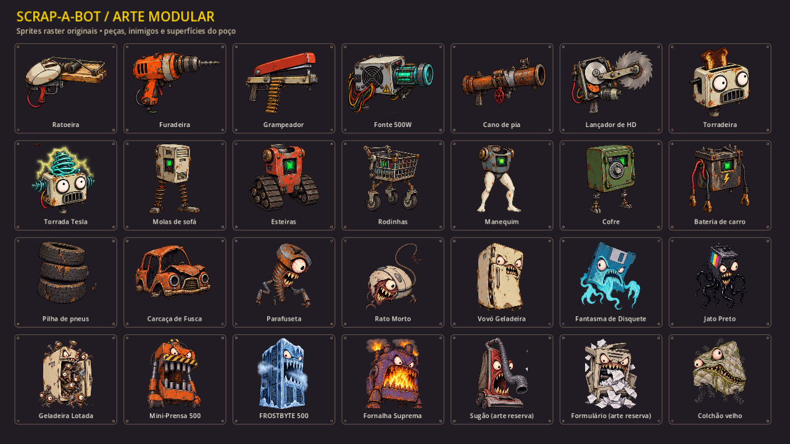

# SCRAP-A-BOT — Implementação de pendências e artes

Data: 10/09/2026. Godot 4.7.2. Complementa os registros de 09/09 e 10/09 sem
reescrever sua história. O projeto já possuía alterações locais quando esta tarefa
começou; elas foram preservadas. Não houve commit, publicação nem alteração intencional
do save do jogador. Todos os testes/capturas usam arquivos de save exclusivos.

## Resultado

O protótipo passou a usar artes raster de sucata cartunesca inspiradas na direção visual
de Earthworm Jim. A montagem do robô acompanha os quatro slots; braços giram com a mira,
cabeça inclina, peças respiram e recebem deformação. Cenário tem perspectiva pintada,
paralaxe discreta, sombras e faces dos obstáculos. Colisões continuam no plano 2D.

## Comparação com a documentação

| Pendência | Implementação nesta entrega |
|---|---|
| Todas as entidades em formas provisórias | Dois atlas PNG com alpha, fundo PNG, composição modular, HUD com ícones e fundos nos menus |
| Tesla disponível somente por debug | Receita de Torradeira + Bateria, comprável e executável na Bancada |
| Mochila inexistente | Quatro espaços para módulos; persiste entre setores e limpa na nova run |
| Reroll +30 contradizia +40 | Agora 60, 100, 140… antes do desconto de Sorte |
| Revenda ignorava tier | 50% de preço da raridade + custos acumulados de evolução |
| Fusão sem celebração na pausa | Efeito local de 2,5 s, com opção existente de flashes reduzidos |
| Cofre sem defesa | Bloqueio frontal de 70% e reflexão hostil com dano base 2x |
| Chefes apenas desciam | Três fases, posições de ataque no poço, faixas avisadas e recuperação vulnerável |
| Blindagem/imunidade mostravam dano nominal | Enemy/Robot retornam dano aplicado; pool usa esse valor nos números e telemetria |
| Vazamento de áudio na saída do smoke | Sfx.shutdown fecha novas emissões antes de limpar os playbacks |
| Sem evidência visual com janela | Seis capturas reais em 1280×720, renderer Compatibility, RTX 2080 SUPER |

## Arte e integração

- `assets/art/parts_atlas.png`: 1254×1254, 16 ilustrações: 13 peças equipáveis,
  bateria, pneus e carcaça de Fusca.
- `assets/art/enemies_atlas.png`: 1254×1254, 12 ilustrações: 6 comuns/bumpers,
  3 chefes vigentes, colchão e artes de reserva para Sugão/Formulário.
- `assets/art/junkyard.png`: 1672×941. Um cenário; tintas diferentes por setor
  são variações deste mesmo cenário, não cinco biomas autorados.
- `assets/art/atlas_layout.json`: recortes individuais em pixels e retângulos de
  montagem consumidos por `ArtDirector`. Os PNG originais foram preservados.
- `art/art_director.gd`: seleção por ID/nome, composição, deformação, sombras,
  ícones, paralaxe e superfícies. Texturas são carregadas uma vez e mantidas em cache.
- `art/projectile_ink.gdshader`: silhueta oval, contorno e realce sobre o MultiMesh
  existente. Continua sem nó individual por projétil.
- Importação sem perda, alpha preservado e mipmaps gerados. Filtro linear do projeto
  mantido. Preset de exportação inclui o JSON; exportação de executável não foi validada.

Os sprites são imagens produzidas por IA com a ferramenta integrada `image_gen`, a partir
dos prompts registrados em `docs/ART_PROMPTS.md`; não foram extraídos de Earthworm Jim.
São poses únicas com animação procedural, não ciclos tradicionais quadro a quadro.
Os sprites ficaram menores que a resolução solicitada; os tamanhos acima são os reais.
Dimensões visuais foram ajustadas ao poço atual sem ampliar as hitboxes existentes.

## Receita e economia

Na Bancada, **M** compra Bateria de Carro por 90 Sucata. Com Torradeira equipada,
**F** consome uma bateria e equipa Tesla. Preserva tier e a maior raridade entre fonte e
resultado; resultado mínimo Raro. **Delete** vende uma bateria por 45. A compra recusa
saldo insuficiente ou mochila cheia sem consumir dinheiro; uma receita incompatível
não consome ingrediente. Catálogos e peça de origem não são mutados.

A vitrine continua excluindo resultados de receita. Existe **uma** receita jogável.
Não foi produzido o catálogo de 40 receitas previsto para a 1.0.

Valor de revenda de uma peça comum: tier I = 45; II = 85; III = 155; IV = 265.
Receitas usam a tabela de valor do resultado. Ainda requer balanceamento econômico
em sessões humanas, inclusive a vantagem de obter tiers por duplicatas baratas.

## Chefes e defesa

Permanecem Mini-Prensa no setor 1, Frostbyte no 3 e Fornalha no 5. Mudam de fase
em 66% e 33% do HP. Atacam a partir de Y=460 e tendem a parar em Y=620. A morte
é necessária para concluir a onda, mantendo as regras de anti-travamento.

As faixas travam na posição do jogador ao iniciar o aviso. Aviso dura 1,2 s
(Frostbyte 1,35 s). Mini-Prensa usa golpes de coluna; Frostbyte e Fornalha alternam
colunas e estilhaços hostis. Rajadas finais foram limitadas a cinco trajetórias para
preservar uma saída; a fase final aumenta a velocidade. Transição de fase cancela
o ataque anterior. Recuperação expõe o núcleo e aumenta o dano recebido.

Frente da Mini-Prensa olha para a base: reduz 70%; costas recebem 2x. Cofre protege
a direção da mira (produto escalar >= 0,35); invasão atinge a base e não ganha redução.
Refletir um projétil usa o mesmo índice no pool, muda a facção e dobra o dano base.

Isso adapta a progressão vigente ao poço. Não implementa as arenas internas de Sugão,
gravidade, fases detalhadas de Formulário ou todos os comportamentos da seção 5 do GDD.

## Validação

Executor: `powershell -ExecutionPolicy Bypass -File tests/run_tests.ps1`.
Sete cenas: compilação, integração de receita/defesa/assets, chefes, áudio, smoke,
gameplay e percurso completo. Compilação verificou 45 scripts, sem erro.

- Novas transações: compra/fusão recusada, mochila cheia, revenda, reset, catálogo,
  tier, raridade e reroll. Defesa: frente, costas, invasão, reflexão sem duplicação.
- Chefes: aviso sem dano, esquiva, origem do ataque de coluna, fases, faixa segura,
  projéteis hostis, reset do pool e posição de entrada.
- Áudio: 61 playbacks liberados, rajadas, roubo de vozes, pausa e sons tardios.
- Smoke: 40 salas válidas; 800 projéteis a 1400 px/s sem escaparem da arena.
  Mediana **1,69 ms**, p99 **2,04 ms**, zero quadros acima de 8 ms nesta execução.
  É física no editor/desktop, não medição de FPS do Steam Deck nem custo completo do renderer.
- Gameplay com input simulado: setor 1, rebatedor, piso, vapor, pausa/foco, bumpers,
  morte, legenda e desafio diário.
- Percurso completo: quatro Bancadas, três chefes, cinco setores, vitória e nova run
  sem herdar receita/mochila. Usa abate assistido; não comprova dificuldade ou duração de run.
- O primeiro teste de percurso encontrou um playback retido na saída acelerada.
  Corrigido aguardando 300 ms reais após shutdown; repetição encerrou sem vazamentos.
  O executor agora reprova avisos de vazamento ObjectDB.

Capturas: `gameplay.png`, `boss.png`, `workbench.png`, `fusion.png`, `garage.png`,
`gallery.png`, em `docs/visual/`. São cenas organizadas para inspeção, renderizadas
por `tools/capture_visuals.tscn`; não são evidência de uma partida humana completa.
`capture-errors.log` ficou vazio. O script usa save isolado e encerra após capturar.

## Trabalho restante do escopo maior

O marco continua sendo um protótipo em evolução para Vertical Slice, não a 1.0 completa.

1. Animações desenhadas de espera/caminhada/ataque/dash/dano/morte e produção final
   dos atlas conforme resolução/pivôs do GDD. Refinar montagem e silhuetas em combate.
2. Cenários exclusivos por bioma, iluminação autorada, áudio gravado, trilha e vozes.
3. Catálogo ampliado: atualmente 13 peças, 3 CPUs, 1 receita e 3 chefes vigentes;
   faltam os volumes de EA/1.0 e sistemas de desbloqueio correspondentes.
4. Sugão, Formulário, chefe secreto, final verdadeiro, elites e demais comportamentos
   específicos de peças; artes de reserva não equivalem a encontros implementados.
5. Prateleira de CPUs, coolers, cosméticos, contratos completos, rádio/narrativa,
   replay “Salvar Vergonha” e integração de público.
6. Menu completo de opções/acessibilidade, navegação de menus por controle, localização,
   conquistas, exportação final e validação no Steam Deck.
7. Balanceamento humano de uma run completa e da economia; desafio diário ainda herda
   upgrades permanentes, conforme limitação já registrada anteriormente.
8. Atualizar GDD v1.1 consolidado, mantendo explícitas as divergências entre visão da
   arena aberta e regras atuais do poço. Os adendos F/G registram a implementação atual.
