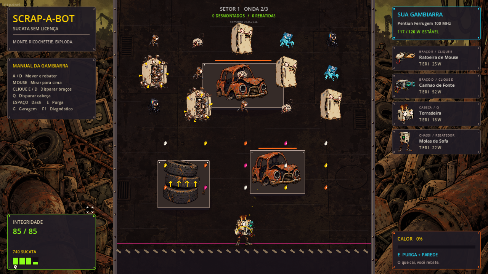

# SCRAP-A-BOT — Protótipo com arte 2D/2.5D

Implementação do marco **Protótipo** do GDD (seção 7.5):

> *"Um retângulo cinza atirando bolas que quicam. A meta é única: o ricochete precisa
> ser divertido sem arte nenhuma. Se não for, o projeto é cancelado aqui, e isso é barato."*

O formato atual é o **poço vertical**, registrado em `GDD_ADENDOS.md`, seção F. O robô anda
na linha de defesa, atira para cima, rebate de volta o que cai e perde o que passa.

O protótipo tem sprites raster originais e cenário de sucata com paralaxe e sombras.
A direção visual usa Earthworm Jim como referência, com eletrônicos grotescos e
contornos de desenho animado. O áudio continua sintetizado.

O padrão atual para mobs e bosses está em
[Método de construção de mobs](docs/METODO_CONSTRUCAO_MOBS.md), com instruções para
agentes em [AGENTS.md](AGENTS.md): assets próprios por personagem, peças articuladas
com encaixes completos, boca e olhos estruturados, animação interpolada e VFX
vinculados ao emissor. O método antigo de deformação a 12 poses/s é legado;
a conversão do bestiário acontece por personagem.



O registro mais recente é [Expansão do bestiário — 11/09](DOCUMENTACAO_EXPANSAO_MOBS_2026-09-11.md):
oito novos monstros com habilidades ativas, quatro novos obstáculos, canal alfa transparente
processado (`assets/art/expansion_atlas_alpha.png`), 10 sintetizadores procedurais de áudio,
três receitas avançadas de fusão na Bancada e variações visuais completas dos 5 biomas de setor.
O relatório complementa [Implementação e artes — 10/09](DOCUMENTACAO_IMPLEMENTACAO_ARTES_2026-09-10.md).

## Rodar

```
Godot_v4.7.2-stable_win64.exe --path .
```

| Tecla | Ação |
|---|---|
| A / D | mover na linha de defesa |
| mouse | mirar, sempre para cima |
| botão esquerdo / direito | disparar braço esquerdo / direito |
| espaço ou shift | dash |
| Q | habilidade da cabeça (Câmera, Boneca) ou disparo da cabeça que atira (Torradeira) |
| E | Purga de Calor, que ergue uma parede de vapor no ponto mirado |
| G | abrir / fechar a Garagem |
| B | abrir / fechar a Bancada |
| F1 | painel de desenvolvimento |
| F2 | gerar nova arena |
| F3 | teste de estresse: 800 projéteis |
| F4 | alternar formas de quique para daltonismo |
| F5 | percorrer todas as CPUs, inclusive as bloqueadas (debug) |
| 1 / 2 / 3 | trocar braço esquerdo / braço direito / cabeça |
| F6 | tremor de tela em 0%, para ver a vinheta substituta |
| R | zerar telemetria |

**Na Garagem:** espaço inicia a run, H inicia o desafio de hoje, C copia a legenda da última
run, 1 a 5 compram upgrades, A e D ajustam o nível de risco, Z e X escolhem a CPU na prateleira.

**Na Bancada:** 1 a 4 compram da vitrine (fundem se a peça for igual à equipada), R faz
reroll, H solda, T escolhe o slot do enxerto, G enxerta o módulo selecionado, espaço segue para o próximo setor.

**Módulos, receitas e enxertos da Bancada:** navegue entre os dez módulos com **<** / **>** (ou setas / **Z** / **X**). Cada módulo pode ser comprado (**M**), vendido (**Delete**), enxertado na peça do slot alvo (**G**, até dois por peça, quatro com a Cyrix Bode) ou fundido na receita que o usa (**F**).
- **Torrada Tesla:** Torradeira + Bateria de Carro (**M**, 90 Sucata) -> funde com **F**.
- **Perfuratriz Diamantada:** Perfuratriz + Broca Diamantada (**M**, 120 Sucata) -> perfura 3 alvos a 1450 px/s.
- **Bazuca Napalm do Seu Nildo:** Lança-Tubo + Botijão de Gás (**M**, 140 Sucata) -> 110 de dano e ricochete acelerado.
A mochila guarda até quatro módulos entre setores; **Delete** vende o módulo por metade do valor.
As receitas preservam o tier da peça-base. Reroll custa 60, 100, 140…; revenda inclui custos de evolução.

Os dois menus pausam o jogo e recebem teclado assim que abrem.

## Testes

```
powershell -ExecutionPolicy Bypass -File tests\run_tests.ps1
```

Sai com código 0 ou 1, então serve direto como passo de integração contínua. O executor
importa o projeto antes de tudo, porque a pasta `.godot` não vai para o git e sem ela
nenhum `class_name` compila num clone limpo. Depois roda oito cenas headless e oito testes de rig por `--script`, e cada um
só passa com código 0, a linha `=== TUDO OK ===` e nenhum `SCRIPT ERROR` na saída.

- **`tests/compile_check.tscn`** carrega todos os scripts do projeto. Não referencia nenhuma
  classe do jogo, então nunca deixa de compilar quando um script de gameplay quebra.
- **`tests/smoke.tscn`**, com semente fixa, verifica tunelamento com 800 projéteis a
  1400 px/s, as restrições de arena, a tabela de multiplicador, o teto de hitstop, isolamento
  dos fluxos de RNG, metaprogressão, desafio diário, Bancada com fusão e troca, raridade da
  vitrine por setor, reciclagem do pool de inimigos, onda de bumpers, invasão da base,
  legenda de fim de run, ausência de RNG global no código de gameplay e o custo de física
  por quadro contra o orçamento de 2,4 ms do GDD 7.2.
- **`tests/gameplay.tscn`** sobe a cena principal e joga por input simulado: anti-travamento
  de inimigo, rebatedor, chão do poço, parede de vapor, setor 1 inteiro, pausa e foco da
  Bancada, onda de bumpers do setor 2, legenda de morte e desafio de hoje pela Garagem.

- **`tests/integration_additions.tscn`** verifica receita, mochila, saldo, revenda,
  defesa/reflexão do Cofre, dano mitigado na telemetria e assets com alpha.
  Também o piso de TDP das CPUs (adendo A.5), o reset entre setores, a barra de recarga,
  a fonte de dano dos filhos de divisão, cenário imune a tiro inimigo, dano por risco e
  isolamento de recursos nos clones, as habilidades das cabeças (Câmera, Boneca, Rádio-Relógio e
  Abajur), os enxertos e a prateleira de CPUs com save v3.
- **Testes de rig** (`tests/*_motion.gd`, `creature_mouths.gd`, `creature_joint_contacts.gd`,
  `boss_revision.gd`) verificam rigidez, continuidade, bocas e juntas dos rigs articulados.
- **`tests/boss_combat.tscn`** verifica blindagem, fases, telegrafia, esquiva e pool dos chefes,
  os perfis de dados dos cinco chefes, Sugão (sucção, filtro HEPA, bolas de pelo, fase 3),
  Formulário (cabeçote, esteira, PAPER JAM), promoção de elite e hitstop roteirizado.
- **`tests/mob_expansion.tscn`** verifica habilidades, divisões, bloqueios, vento, laser,
  explosão, fusão, fabricação e reciclagem dos oito novos monstros.
- **`tests/audio_cleanup.tscn`** verifica liberação dos playbacks, inclusive sons tardios.
- **`tests/run_completion.tscn`** atravessa os cinco setores com abate assistido: quatro
  bancadas, cinco chefes, vitória, persistência da receita e reinício limpo. Não mede balanceamento.

Gameplay e percurso completo usam `--fixed-fps 120`, que comprime minutos de partida em segundos.
O de fumaça roda em tempo real, porque com a flag o laço principal atropela a thread de
áudio e o benchmark mostra picos falsos.

Os testes usam saves próprios em `user://` e nunca tocam `user://save.json`.

Última medição do benchmark, binário de editor com depuração ligada, 800 projéteis, sem
outro processo pesado na máquina: **mediana 1,87 ms, p99 2,07 ms, zero quadros acima de
8 ms.** Rodar dois testes em paralelo gera picos falsos. O número do Steam Deck precisa de
um template de exportação e ainda não foi medido. Na implementação de artes, a medição
foi **1,69 ms de mediana / 2,04 ms de p99**, também sem quadros acima de 8 ms.

Para executar um teste específico: `powershell -ExecutionPolicy Bypass -File tests/run_tests.ps1 -Only boss_combat`.
O executor também reprova vazamentos de ObjectDB. As capturas com renderer real ficam em
`docs/visual/`; podem ser regeneradas executando `res://tools/capture_visuals.tscn` com janela.
Essa cena usa save isolado, gera seis capturas e encerra.

## Estrutura

```
autoload/     combat_feel (hitstop e trauma), game_rng (fluxos semeados e semente do dia),
              sfx (síntese e limitador de vozes), vfx (pools de efeito), telemetry (GDD 7.7),
              game_input, meta_manager (Cobre, Sucata, árvore de 5 ramos e desafio diário)
combat/       projectile_pool (o coração, com rebatedor e chão), projectile_type, fire_context,
              wave_director (ondas e onda de bumpers), enemy_pool, steam_wall, head_ability
data/         part_data, cpu_data, part_behavior + comportamentos, part_library
actors/       robot, enemies (com anti-travamento), arena_camera
generation/   arena_generator, obstacle
ui/           hud, debug_overlay, garage_ui, workbench_ui, run_caption (legenda de fim de run)
tests/        compile_check, smoke, gameplay, run_tests.ps1
scenes/       prototype
```

## O que está implementado

**Física e ricochete (GDD 3.3, o pilar 3).** Vetores paralelos, sem nós por projétil.
Detecção por `cast_motion` com resolução no ponto de contato. Multiplicador de dano por
quique com teto rígido, jitter anti-loop, velocidade mínima e máxima, imunidade de acerto
repetido, restituição por superfície, facção, perfuração, divisão com linhagem limitada e
política explícita de estouro do pool. Renderização por `MultiMesh` com interpolação no
lado do render.

**O formato de poço (GDD_ADENDOS F).** O robô é o rebatedor: o projétil que cai no corpo
volta para cima com ângulo dado pelo ponto de contato, ganha um quique e não gasta
orçamento. A restituição vem do chassi, de 1,00 nas Rodinhas a 1,60 no Cofre. O que passa
do robô morre no chão do poço. A Purga de Calor ergue uma parede de vapor de restituição
1,35 no ponto mirado. Nos setores 2 e 4 a segunda onda é de bumpers: geladeiras que
aceleram o tiro e viram enxame quando morrem. Inimigo que invade a base machuca e não paga
nada.

**Feel (GDD 3.4, o pilar 1).** Hitstop com regra de maior-valor-vence e teto de 130 ms,
trauma de câmera com amplitude quadrática, escala musical ascendente de quique com
limitador de 4 vozes por som e roubo da mais antiga, squash and stretch por evento com pivô
na base, coice e antecipação de câmera na direção da mira.

**Modularidade (GDD 4, o pilar 2).** Peça é dado, não código: `PartData` com array de
`PartBehavior`. A TORRADA TESLA é a Torradeira com um comportamento a mais no array e o
leque de 3 para 5, sem uma linha de código nova. Sistema de Watts com subvoltagem, sistema
de calor com superaquecimento e Purga. Quatro cabeças com habilidade ativa ou passiva, dez
módulos que servem de receita ou de enxerto, e oito CPUs na prateleira da Garagem, cada uma
com a condição de desbloqueio visível.

**Economia e retenção (GDD 6 e 1.4).** Garagem com árvore de 25 nós e nível de risco.
Bancada com vitrine pela raridade do setor, fusão de duplicata, troca com reembolso de 50%,
reroll e solda. Legenda automática de fim de run, copiável. Desafio de hoje com semente da
data em UTC, loadout fixo e 150 de Cobre uma vez por dia.

**Determinismo (GDD 7.3).** Toda aleatoriedade da run passa por fluxos semeados e separados
por sistema: drops, sala, ondas, vitrine, combate, IA e efeitos. A semente aparece na HUD e
no fim da run. O teste de fumaça falha se alguém chamar o RNG global no código de gameplay.

**Arena (GDD 3.3.4).** Gerador com validação de todas as restrições, incluindo busca em
largura, com o relatório visível no painel.

**Telemetria (GDD 7.7).** A métrica que decide o pilar 3, mediana do multiplicador de
quique no momento do dano, está na tela durante o jogo, junto com rebatidas, perdas no chão
e invasões da base.

## Documentos e Especificações

- `DOCUMENTACAO_IMPLEMENTACAO_ARTES_2026-09-10.md` — Entregas, validação, adaptações e pendências desta implementação.
- `assets/art/` — Dois atlas PNG com alpha, cenário PNG e metadados JSON dos recortes/montagem.
- `docs/ART_PROMPTS.md` — Prompts e procedência das três imagens geradas com a ferramenta integrada.

- `GDD_SCRAP-A-BOT.md` — O GDD v1.0.
- `GDD_ADENDOS.md` — Lacunas, contradições e riscos do GDD, e na seção F a decisão do formato de poço.
- `DOCUMENTACAO_2026-09-10.md` — Registro completo da sessão de 10/09: o que mudou, APIs alteradas, decisões, incidentes e pendências. Comece por aqui numa nova sessão.
- `DOCUMENTACAO_2026-09-09.md` — Relatório técnico de 09/09, anterior às mudanças da seção F.
